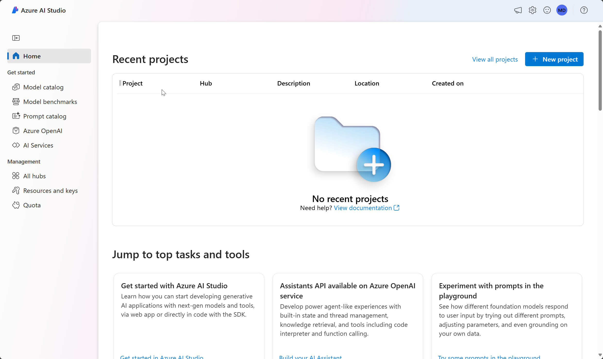
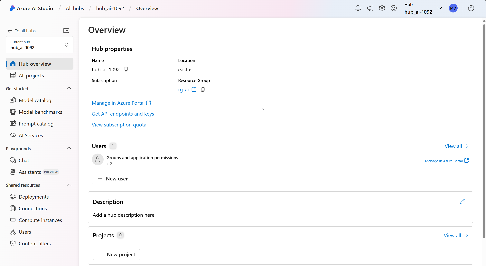
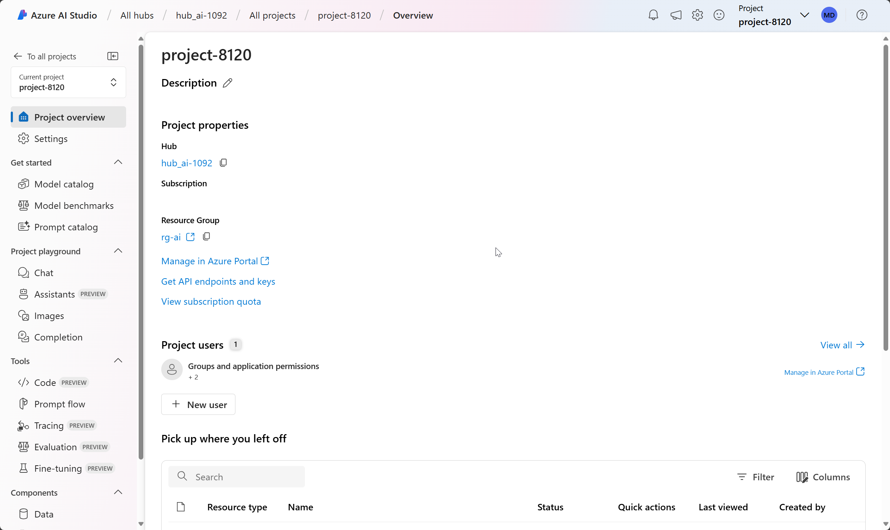

---
lab:
    title: 'Explore Azure AI Studio'
---

# Explore Azure AI Studio

In this exercise, you'll use Azure AI Studio to create a project and explore a generative AI model.

> **Note**: Azure AI Studio is in preview at the time of writing, and is under active development. Some elements of the service may not be exactly as-described, and some features may not work as expected.

This exercise takes approximately **30** minutes.

> [!NOTE]
> To complete this exercise, your Azure subscription must be approved for access to the Azure OpenAI service.

## Open Azure AI Studio

Let's start by viewing Azure AI Studio.

1. In a web browser, open [https://ai.azure.com](https://ai.azure.com) and sign in using your Azure credentials. The home page of Azure AI Studio looks similar to the following image:

    

1. Review the information on the home page and view each of the tabs, noting the options to explore models and capabilities, create projects, and manage resources.

## Create an Azure AI Hub

You need an Azure AI Hub in your Azure subscription to host projects. You can either create this resource while creating a project, or provision it ahead of time (which is what we'll do in this exercise).

1. On the **Manage** page, select **+ New Azure AI Hub**. Then, in the **Create a new Azure AI Hub** wizard, create a new resource with the following settings:
    - **Azure AI Hub name**: *A unique name*
    - **Subscription**: *Your Azure subscription*
    - **Resource group**: *Create a new resource group with a unique name, or select an existing one*
    - **Location**: *Choose any Azure OpenAI service supported location*
    - **Azure OpenAI**: (New) ai-*hub_name*
    - **AI Search**: (None)

    After the Azure AI Hub has been created, it should look similar to the following image:

    

1. Open a new browser tab (leaving the Azure AI Studio tab open) and browse to the Azure portal at [https://portal.azure.com](https://portal.azure.com?azure-portal=true), signing in with your Azure credentials if prompted.
1. Browse to the resource group where you created your Azure AI Hub, and view the Azure resources that have been created.

    

1. Return to the Azure AI Studio browser tab.
1. View each of the pages in the pane on the left side of the page for your Azure AI Hub, and note the artifacts you can create and manage. On the **Connections** page, observe that a connection to the Azure OpenAI resource you created with your Azure AI Hub named **Default_AzureOpenAI** has already been created.

## Create a project

An Azure AI Hub provides a collaborative workspace within which you can define one or more *projects*. Let's create a project in your Azure AI Hub.

1. In Azure AI Studio, on the **Build** page, select **+ New project**. Then, in the **Create a new project** wizard, create a project with the following settings:
    - **Project name**: *A unique name for your project*
    - **AI Hub**: *Your AI Hub*
1. Wait for your project to be created. When it's ready, it should look similar to the following image:

    

1. View the pages in the pane on the left side, expanding each section, and note the tasks you can perform and the resources you can manage in a project.

## Deploy and test a model

You can use a project to create complex AI solutions based on generative AI models. A full exploration of all of the development options available in Azure AI Studio is beyond the scope of this exercise, but we'll explore some basic ways in which you can work with models in a project.

1. In the pane on the left for your project, in the **Components** section, select the **Deployments** page.
1. On the **Deployments** page, select **+ Create** and create a real-time endpoint deployment.
1. In the **Select a model** list, select the **gpt-35-turbo** model and confirm your selection. Then deploy the model with the following settings:
    - **Deployment name**: *A unique name for your model deployment*
    - **Model**: gpt-35-turbo
    - **Model version**: *Select the default version*
    - **Advanced options**:
        - **Content filter**: Default
        - **Deployment type**: Standard
        - **Tokens per Minute Rate Limit (thousands)**: 5K

    > **Note**: Reducing the TPM helps avoid over-using the quota available in the subscription you are using. 5,000 TPM is sufficient for the data used in this exercise.

1. After the model has been deployed, in the pane on the left, in the **Tools** section, select the **Playground** page.
1. In the **Playground** page, ensure that your model deployment is selected in the **Configuration** section. Then, in the **Chat session** section, enter a query such as *What is AI?* and view the response:

    

## Clean up

If you've finished exploring Azure AI Studio, you should delete the resources you have created in this exercise to avoid incurring unnecessary Azure costs.

1. Return to the browser tab containing the Azure portal (or re-open the [Azure portal](https://portal.azure.com?azure-portal=true) in a new browser tab) and view the contents of the resource group where you deployed the resources used in this exercise.
1. On the toolbar, select **Delete resource group**.
1. Enter the resource group name and confirm that you want to delete it.
